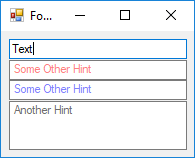

# TextBox Watermark

In this example I created a `TextBox` control which shows watermark (hint or cue banner or place holder). 

You can set the hint, using `Hint` property. The control also can show watermark when `TextBox` is multi-line. You can also set `HintColor` for the control.
The painting will be disappear when the `TextBox` get focus.

To show a watermark in a TextBox you can use either of following options:

- You can send a `EM_SETCUEBANNER` message to the `TextBox`
- You can hanlde `WM_PAINT` and draw the watermark yourself.

If you use `EM_SETCUEBANNER`, then there will be 2 problems. The text always will be shown in a system default color. Also the text will not be shown when the `TextBox` is `MultiLine`.

Using the painting solution, you can show the text with any color that you want. You also can show the watermark when the control is multile. 

